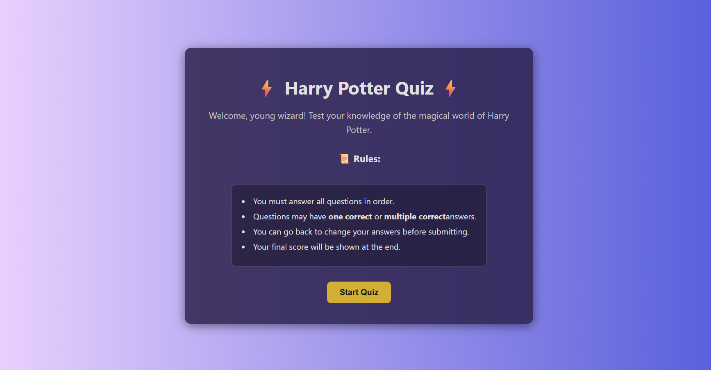
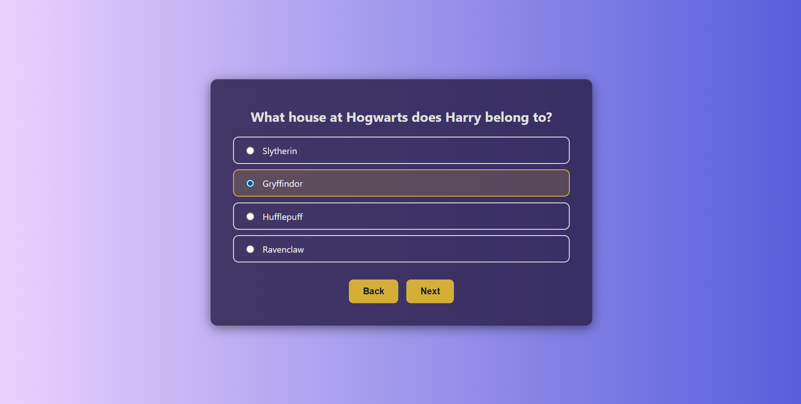
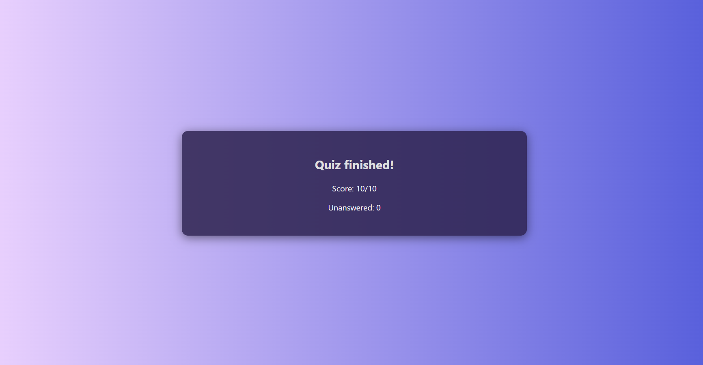

# Harry Potter Quiz App

A fun, interactive quiz web app to test your knowledge of the magical world of Harry Potter!  
Built with HTML, CSS, and JavaScript. Responsive and easy to use on desktop and mobile.

---

## Features

- **Single & Multiple Choice Questions:**  
  Supports both types for a varied challenge.
- **Navigation:**  
  Go back and forth between questions before submitting.
- **Score Calculation:**  
  See your score and unanswered questions at the end.
- **Responsive Design:**  
  Looks great on phones, tablets, and desktops.
- **Modern UI:**  
  Stylish backgrounds, animated transitions, and clear layouts.

---

## Getting Started

1. **Clone or download** this repository.
2. Open `quiz.html` in your browser.

---

## File Structure

- `quiz.html` — Main HTML file for the quiz interface.
- `quiz.css` — Styles for layout, colors, and responsiveness.
- `quiz.js` — Quiz logic, question navigation, and scoring.

---

## How to Play

1. Click **Start Quiz**.
2. Answer each question (some are single choice, some are multiple).
3. Use **Back** and **Next** to navigate.
4. Click **Submit** on the last question to see your score.

---
## Screenshots

 

- **Questions:**  
  Edit or add questions in `quiz.js`.

**Made by sravan_venkata**